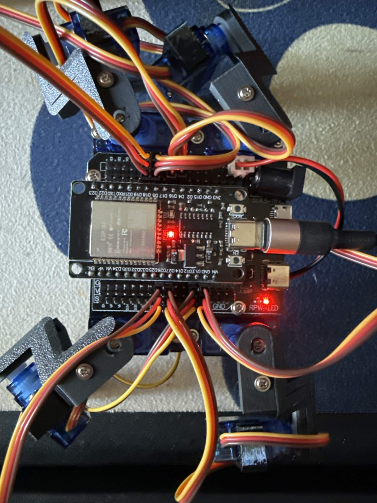

# bot1
https://temporary-nimble-pumice-vgp2mlx-2o9dcdme8-anon-mu-topaz.vercel.app/brain.html

The computer is the brain. The robot is the body.

The photo shows the four-legged robot. The ESP32 sits in the middle, and the red light means the board is powered. The wires go to eight servos. The motors on the limbs only rotate the legs sideways. The motors on the feet raise and lower each foot.

The brain runs on the computer, not on the board. The neurons come from the [FlyWire Codex FAFB fruit-fly brain](https://codex.flywire.ai/?dataset=fafb). The loaded set is the heading and steering group: 167 neurons, including EPG, PEN, PEG, PFL, DNa01, and DNa02, with 1,968 synapses between them. The computer reads the EPG compass as an angle. While that angle stays near the goal, the robot keeps walking. While the error stays large, the same step continues with a shorter stride on the inside, for as many steps as the error takes to fall, usually four or five. The ESP32 only moves the eight servos.

## What the neurons add

Before this circuit, forward and turn were two different motions. A turn replaced one step of the walk with a separate pose. The legs lost their rhythm, and the body jerked. A single large heading correction also cleared the error in one step, so the robot twitched and then walked straight again.

The 167 neurons fix that judgment. The EPG bump is a compass. PEN and PEG move the bump when the heading changes. PFL carries it to DNa01 and DNa02, one descending neuron on each side. Each step asks the same question: is the compass still off the goal? A small error keeps the forward gait. A large error keeps turning inside that gait until the compass catches up. Nothing in the loop counts out one isolated turn.

The neurons do not create the step itself. The same result shows up in [Fly Brain Bridge](https://www.doriantodd.com/projects/fly-brain-bridge/): a point-neuron model of the fly does not produce a stepping rhythm, so a separate gait still has to move the legs. Here that gait is one smooth walk. The neurons only choose whether the next steps stay straight or keep curving.

The full FlyWire brain has about 140,000 neurons. This robot runs the steering slice, not vision, taste, or the escape circuit, so it does not react to sugar, shadows, or antennae.

The neuron page is a static view of this circuit and a simplified model of the robot. Buttons on that public page cannot reach a robot on a home network. Control stays on the phone or the computer when they are on the same Wi-Fi as the ESP32.

A related project is [Fly Brain Bridge](https://www.doriantodd.com/projects/fly-brain-bridge/) by Dorian Todd. It runs a much larger male-fly nervous system and drives another quadruped. It is a reference for this robot, not the circuit loaded here.
